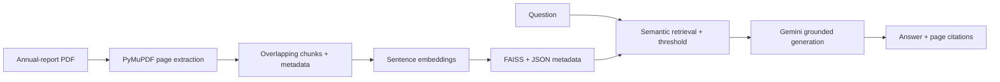

# AI Financial Risk & Investment Copilot

## Module 4 — RAG + LLM Financial Assistant

This independent Python service makes annual reports searchable and explainable. It is a decision-support component, not investment advice and never guarantees an outcome.



## Why RAG?

Gemini alone can use general knowledge and may invent company facts. Retrieval-Augmented Generation (RAG) finds relevant passages first, then supplies only those passages to Gemini. An embedding is a numeric representation of a passage's meaning; similarity search finds passages semantically related to the question. FAISS provides fast local similarity search and the accompanying JSON file maps each vector back to its company, document, page, chunk ID, and text.

Pages are extracted separately and chunks retain their originating page. Chunks overlap by 150 words (by default) so a fact spanning a boundary is not lost. The API applies a configurable similarity threshold: with no strong evidence it returns an explicit insufficiency message and does not call Gemini.

## Layout

```text
app/                 FastAPI service, PDF processor, FAISS RAG engine, Gemini layer
data/documents/      uploaded PDFs (gitignored)
data/indexes/        persisted FAISS index and metadata (gitignored)
scripts/             local ingestion helper
tests/               extraction, retrieval, LLM safety, and API-contract tests
```

## Setup and run

```bash
python3 -m venv .venv
source .venv/bin/activate             # Windows: .venv\Scripts\activate
pip install -r requirements.txt
cp .env.example .env
uvicorn app.main:app --reload
```

Set `GEMINI_API_KEY` in `.env` to enable generated explanations. Without a key, upload and retrieval work normally, but `/query` returns `answer_mode: "retrieval_only"` rather than pretending to produce an LLM answer.

Important environment variables are `GEMINI_MODEL`, `EMBEDDING_MODEL`, `DOCUMENT_STORAGE_PATH`, `VECTOR_STORE_PATH`, `TOP_K`, and `SIMILARITY_THRESHOLD`. No credential is committed.

## API contract

| Endpoint | Purpose |
| --- | --- |
| `GET /health` | service readiness |
| `POST /documents/upload` | upload and immediately index a PDF |
| `POST /documents/ingest` | index an existing safe filename from `data/documents` |
| `GET /documents` | list indexed documents |
| `POST /query` | retrieve evidence and generate a grounded response |

Upload an annual report:

```bash
curl -X POST http://127.0.0.1:8000/documents/upload \
  -F 'file=@TCS_Annual_Report_2025.pdf' \
  -F 'company=TCS' \
  -F 'document=TCS Annual Report 2025'
```

Query it:

```bash
curl -X POST http://127.0.0.1:8000/query \
  -H 'Content-Type: application/json' \
  -d '{"query":"What does the annual report say about debt?", "company":"TCS", "top_k":5}'
```

For a company comparison, send `"companies":["TCS","Infosys"]` instead of `company`; the service retrieves top-K evidence separately for each company and labels every result with its source company.

The response includes `answer`, `grounded`, `answer_mode`, page-level `sources`, and `retrieved_context`. Each source has `company`, `document`, `page`, `chunk_id`, and `retrieval_score`. Node/Express can call this endpoint directly and pass the JSON to the Next.js frontend. Its own risk, trend, or sentiment output can be included in `module_context`; that context is labelled separately from document evidence.

## Testing and evaluation

```bash
pytest -q
```

Tests use fake embeddings and do not require a Gemini key. For formal evaluation, save a small question set with expected document/page, then record the retrieved pages, scores, answer, and a human groundedness judgement. Do not fabricate relevance or faithfulness scores.

`scripts/evaluate_retrieval.py` writes that retrieval record from a JSONL question file (`question`, `expected_pages`, optional `company`); human reviewers can then add generated-answer and groundedness assessments.

## Limitations and next steps

The MVP uses text-layer PDF extraction, so scanned PDFs need OCR and complex tables may need dedicated extraction. Retrieval is semantic-only; future improvements include hybrid keyword search, reranking, table support, company-comparison orchestration, PostgreSQL metadata, and evaluation datasets.

## Viva summary

RAG means **retrieve first, generate second**. Top-K is the number of most similar chunks returned. FAISS compares a question embedding against stored chunk embeddings; page metadata lets the user verify every cited claim in the original PDF. FastAPI exposes this as a small, independently deployable service for the central Node.js backend.
